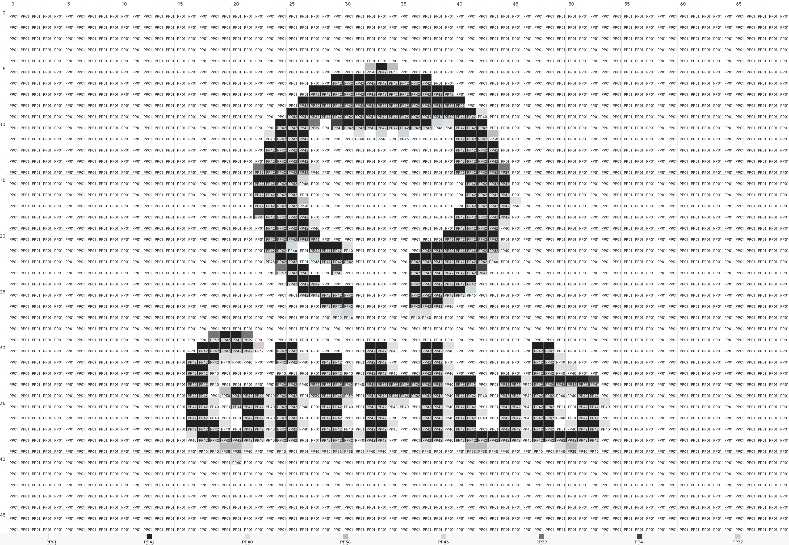
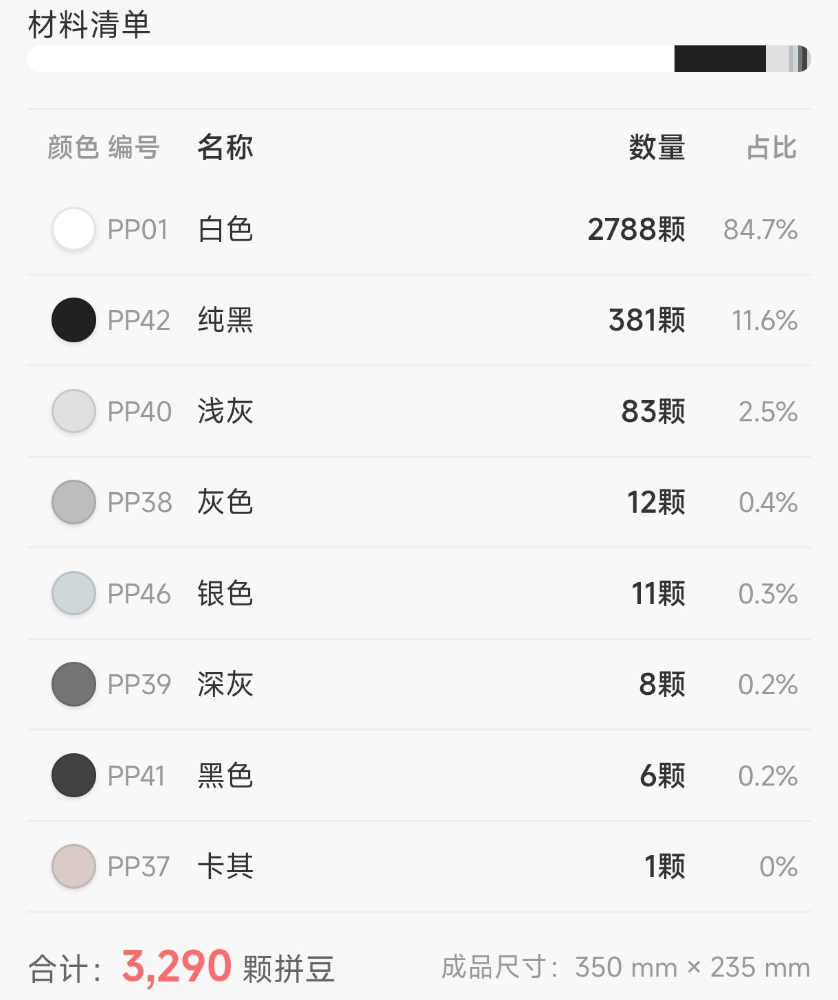

# 拼豆格子（PinDou Grids）微信小程序

<p align="center">
  
  
  
</p>

> 上图依次为：**原图 → 拼豆模板渲染 → 材料清单**。完整操作流程演示见 [`docs/screenshots/4-demo.gif`](docs/screenshots/4-demo.gif)。

把图片一键转换成「拼豆 / 像素画」制作模板的小程序：自动生成行列标号、色号对照、材料清单，并支持导出高清制作图。

> 本项目已通过一轮安全与质量审查，欢迎提 Issue / PR 一起找 BUG、改进功能。

## 功能

- 图片取色 → 生成拼豆网格模板（支持缩放、行列标号、图例）
- 取色器：从图片选取颜色，识别最接近的色卡（艺术卡 / Hama 等）
- 历史画廊：保存 / 查看 / 删除模板，支持材料清单与尺寸预览
- 内容安全：图片上传经微信 `security.mediaCheckAsync` 机审，fail-closed 拦截违规内容
- 隐私合规：已在 `privacy.json` 声明 `chooseMedia` / `chooseAvatar` / `saveImageToPhotosAlbum` 并启用 `__usePrivacyCheck__`

## 技术栈

- 微信小程序**原生框架**（WXML / WXSS / JS）
- 微信**云开发**：云函数 `secCheck`（限频 + 内容安全主流程）、`mediaCheckResult`（微信推送回调）
- 渲染引擎：`utils/beadEngine.js`（canvas 绘制、图例、缩放自适应）

## 目录结构

```
app.js / app.json / app.wxss     全局入口与配置
pages/                           index（首页）/ template（编辑画布）/ gallery（画廊）/ profile（我的）
components/                      material-list、palette-selector 等
utils/                          beadEngine（渲染引擎）、secCheck（前端安全封装）、colorData / colorLibrary（色卡）
cloudfunctions/                 secCheck、mediaCheckResult 云函数
test/                           纯 Node 测试用例（见下）
privacy.json / sitemap.json / project.config.json   小程序配置
```

## 本地开发

1. 用**微信开发者工具**导入本项目根目录。
2. `project.config.json` 中的 `appid` 可替换为你自己的小程序 AppID（公开标识，不影响代码）。
3. 开通**云开发**环境，首次运行会在 `app.js` 中 `wx.cloud.init` 自动初始化。

## 图标资源

`app.json` 的 tabBar 图标（`images/icons/*.png`，共 6 张）由 `_gen_icons.py` 生成，且**已纳入版本控制**——正常 `git clone` 后即可直接导入运行，无需任何预处理步骤，不会出现图标 404。若你改动了图标源或想重新生成，执行：

```bash
python _gen_icons.py
```

（脚本会在 `images/icons/` 不存在时自动创建目录；正常开发无需手动运行。）

## 运行测试

测试为纯 Node 脚本，无需测试框架 runner，直接运行单个文件即可：

```bash
node test/template_preview_autofit.test.js
node test/sec_check_ratelimit_atomic.test.js
node test/gallery_display_clamp.test.js
# ……test/ 下每个 *.test.js 均可独立运行
```

> 提示：测试用例覆盖渲染自适应、限频原子性、内容安全 fail-closed、画廊展示钳制等关键路径。

## 安全与隐私

### 内容安全链路（mediaCheckAsync 异步机审）

用户上传图片 → 前端压缩（≤800px，见下）→ 云存储中转 → `secCheck` 云函数调微信 `security.mediaCheckAsync`（异步）→ 微信通过 `wxa_media_check` 消息推送结果 → `mediaCheckResult` 云函数写入 `sec_check_results` → 前端轮询读取 `suggest`（pass 放行 / review、risky 拦截）。

- **超时兜底（不悬挂）**：前端提交后以 1s 间隔轮询最多 **20 次（约 20s）**，若回调未到达（网络抖动 / 微信推送丢失 / 未配置 mediaCheckResult）则按 **fail-closed 拦截**并提示「内容安全检测暂不可用，请稍后重试」——检测结果**永远不会处于悬挂状态**，超时即拒绝放行。
- **fail-closed 语义**：检测链路任何环节未完成（通道不可用 / 超时 / 图片过大 / 限频）一律默认拦截，仅**开发版 develop** 回退放行便于本地调试；体验版 / 正式版强制拦截。
- **误杀救济**：拦截时按原因区分提示（违规 / 图片过大 / 操作频繁 / 服务不可用），用户可**直接重新选图重试**，本地相册原图不受影响（仅清理本次压缩产生的临时文件）。注：微信内容安全 API 不提供人工申诉通道，误判的唯一救济是更换图片后重试。
- **前端上传前校验**（`validateImageFile`，选图即校验，非仅靠云端）：文件类型必须为图片、**大小 ≤10MB**、**宽高 ≤6000px**、真实格式（基于文件内容而非扩展名）在白名单内，图片信息读取超时按失败拒绝。

### 限频分层

- **后端**：`secCheck` 云函数按 openid **每小时 100 次**窗口限频（数据库原子条件更新，数据库故障时降级单实例内存兜底并告警）。
- **前端**：`index.chooseImage` / `profile.uploadPickerImage` / `template.saveTemplate` 均有**忙碌守卫**（连点忽略），避免同一处理链并发重复消耗检测配额。

### 隐私与数据流

- `privacy.json` 已声明全部隐私接口（`chooseMedia` / `chooseAvatar` / `saveImageToPhotosAlbum`）并启用 `__usePrivacyCheck__`。
- **用户图片上传**：内容安全检测需要临时上传图片到云存储 `sec_check/` 目录，**检测结束后云函数立即删除**该文件（含提交失败分支，隐私设计，测试已断言）；前端异常路径亦有兜底清理。
- **数据保留周期**：检测结果（`sec_check_results`）仅存 `suggest` / `label` / `errcode` / 时间戳，不含图片本体；检测完成或拦截后图片即删除，无长期留存。
- **画廊与历史存储**：模板历史、对照原图、头像均存储于**本地**（`wx.storage` 与 `USER_DATA_PATH` 文件系统），不上传云端；用户在画廊可删除单条历史，页面也提供清理入口。

## 健壮性与容错

### 大图渲染与内存保护

- **分辨率上限**：选图即校验（`validateImageFile`）宽高 **≤6000px** 且 ≤10MB；`generateTemplate` 内部再校验一次（单一真源 `CONSTANTS.MAX_IMAGE_DIMENSION`），超限同步拒绝。
- **降采样**：颜色量化采样最多 **5000 像素**（`SAMPLE_PIXELS`），避免中位切分对超大图全量计算；前端生成前再经 `compressImageIfNeeded` 压缩到 ≤800px 边长，双保险降低 canvas 内存占用。
- **渲染硬上限**：模板渲染（`renderTemplate`）单维 **≤4096px**（与 iOS 画布 4096 维度限制同级，`DIM_HARD`），维度乘积超限优先收缩行数。
- **失败回退**：图片解码失败 / canvas 导出失败均走明确 toast（「图片加载失败」「处理失败，请重试」），不静默；`compressImageIfNeeded` 在 canvas 节点不可用时返回原图路径并补读真实尺寸，下游硬上限兜底。

### 生成性能（不阻塞主线程）

- **规模上限**：模板格子数最多 **8000**（`MAX_PIXELS`，行列乘积由 `clampTemplateSize` 统一钳制）。400×400 这类大图也会被钳到 ≤8000 格，不是 16 万格全量计算。
- **分块让出主线程**：生成按 `CHUNK_ROWS = ceil(rows/24)` 分块，每块完成后 `await setTimeout(0)` 让出主线程一个 macrotask，避免长时间阻塞触发「无响应」警告；抖动分支在**整行处理完**后才让出，保证 Floyd-Steinberg 行序正确。
- **真实进度提示**：`onProgress` 增量上报（50→90+，随已处理行数推进），首页进度条真实刷新，非静态动画。
- **页面存活取消**：调用方传 `shouldCancel`，页面卸载（onHide/onUnload）后生成立即中止（`__cancel` 静默放弃），不浪费计算、不 setData 已销毁页面。

### 导出高清图性能

- **候选降级**：`EXPORT_CELL_CANDIDATES = [50,40,…,8]` 从大到小尝试，首个成功即返回；单候选失败（尺寸超限 / 内存超预算 / canvas 异常）自动降级到更小 cellSize，全部失败才报错。
- **内存预算**：`MAX_EXPORT_BITMAP_BYTES = 33MB`——估算位图字节（宽×高×4）超预算的候选直接跳过，避免低端机尝试 50MB+ 大位图导致 WebView OOM 崩溃。
- **尺寸硬上限**：`MAX_CANVAS_SIDE`（=4096，与渲染 `DIM_HARD` 同源），超出即跳过候选。
- **防挂起兜底**：等待绘制用 rAF + 安全定时器双通道（B17），`canvasToTempFilePath` 失败重试 3 次后抛错降级——任何情况都不会永久挂起阻塞用户。
- **临时文件清理**：导出产物保存到相册后立即 `removeFileIfExists`；启动时 `gcBeadTempFiles` 兜底清扫残留，防止 USER_DATA_PATH 10MB 配额被大 PNG 占满。

### 画廊存储策略

- **条目上限**：历史记录最多 **50 条**（`MAX_HISTORY`，单一真源），超限自动挤出最旧记录（`unshift` + `pop`），被挤出记录的对原图同步清理，避免悬空引用。
- **体积瘦身**：存储前 `slimMaterialList` 剔除颜色对象的生成期缓存（lab/r/g/b）；网格矩阵用 **RLE 压缩编码**（`templateRLE`）替代完整二维数组，单条记录体积大幅下降。
- **配额满处理**：`setStorageSync` 失败（10MB 配额满）时进入降级清理循环（先挤旧记录），仍失败则保留用户数据、不自增版本号、不误报「已删除」，日志记录失败原因。

### 色卡匹配语义

`matchToPalette` **强制映射最近色**（按 Lab 色差遍历取最小），**无阈值跳过**——拼豆本质是用有限色卡（30-50 色）逼近原图，任何像素都必须落到一个珠子颜色，跳过会导致模板缺色。空色卡兜底为白色。成品与原图存在色差是拼豆工艺固有特性，非缺陷。

### 云开发初始化失败

`app.js _initCloud()` 以 try/catch 包裹 `wx.cloud.init`，失败（未开通云开发 / 基础库不支持 / 网络异常）时置 `globalData.cloudAvailable = false` 并记录日志，**不会连锁崩溃**：内容安全检测通道不可用即 fail-closed 拦截并 toast「内容安全检测暂不可用」；画廊等核心功能全部走本地存储，不依赖云端。

### 图标资源

tabBar 图标已提交版本控制，`git clone` 后即可运行。图标由微信原生加载、无运行时回退通道（平台限制），故以**一致性回归测试**（`test/app_icons_integrity.test.js`）锁定：app.json 引用的每个图标路径必须存在、非空、为有效 PNG，且页面路径已声明。

### 页面与索引设计

- **sitemap 索引策略**：`index` / `gallery` / `profile` 允许索引，`template` 编辑页 disallow。本项目**不承载用户生成内容**（画廊模板、历史全部存储于本地 `wx.storage`，无服务端数据），首页为纯工具页，被「小程序搜索」收录无隐私风险，编辑页不收录避免无意义索引。
- **tabBar 与页面导航**：4 个页面中仅 3 个进 tabBar（创作 / 作品 / 我的），`template` 编辑页是**非 tab 详情页**——由 index 选图进入（生成）、由 gallery 点作品进入（`wx.navigateTo` 带参查看/二次编辑），两个入口均已打通；profile 为个人中心不承担编辑入口。路径最短，无需改动。
- **加载态与懒加载**：已开启 `lazyCodeLoading: "requiredComponents"` 按需注入组件，首屏只加载当前页面组件树（本项目页面结构简单，无重型组件依赖）。耗时操作均有明确遮罩加载态：首页生成「正在处理模板...」、template 处理图/分享图「处理图片中...」「制作分享图...」、画廊空列表有引导空态；无骨架屏需求（页面组件少、首次渲染快）。

## 云函数部署

`cloudfunctions/secCheck` 与 `cloudfunctions/mediaCheckResult` 需在**微信开发者工具**中分别「上传并部署：云端安装依赖」。

`cloudfunctions/secCheck` 与 `cloudfunctions/mediaCheckResult` 需在**微信开发者工具**中分别「上传并部署：云端安装依赖」。

- 云函数使用 `cloud.DYNAMIC_CURRENT_ENV`，无需硬编码环境 ID；
- 部署后请验证：图片机审流程、限频、降级恢复告警正常。

## 开源协作

- Bug 反馈：开 Issue，附复现步骤与设备 / 基础库版本。
- 功能建议 / 修复：欢迎 PR，建议先同步设计意图再改核心渲染与云函数逻辑。
- 隐私与安全：涉及 `privacy.json`、`secCheck` 限频 / 内容安全的改动请务必附带测试。

## 许可证

本项目采用 **MIT License**。详见 [LICENSE](./LICENSE)。
